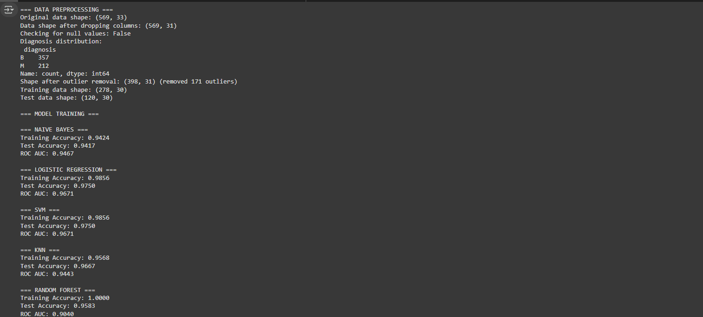
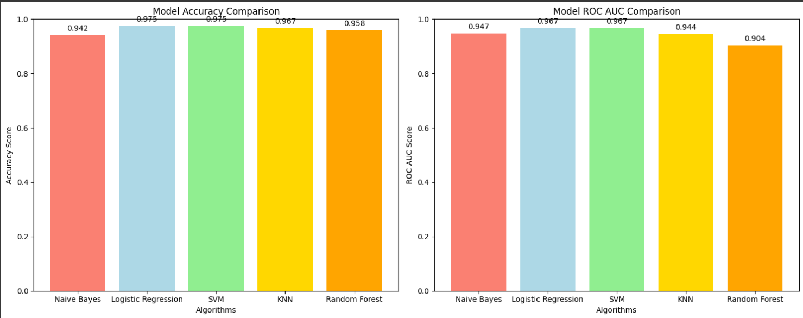
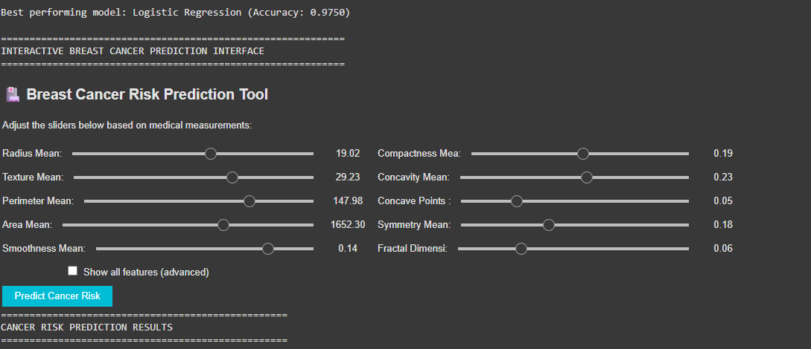
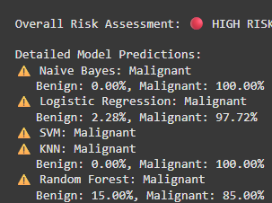
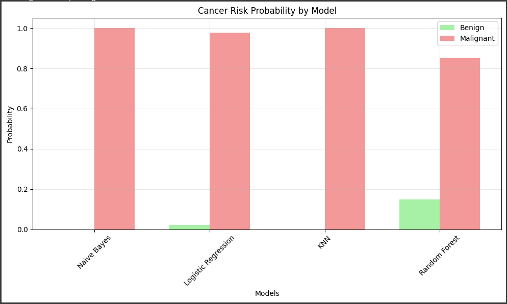
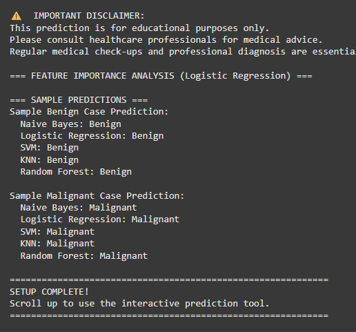

# 🏥 Breast Cancer Prediction Using Machine Learning

[](https://www.python.org/downloads/)
[](https://scikit-learn.org/)
[](LICENSE)
[](CONTRIBUTING.md)

## 📋 Table of Contents
- [Overview](#overview)
- [Features](#features)
- [Dataset](#dataset)
- [Machine Learning Models](#machine-learning-models)
- [Results](#results)
- [Installation](#installation)
- [Usage](#usage)
- [Model Performance](#model-performance)
- [Interactive Features](#interactive-features)
- [Project Structure](#project-structure)
- [Contributing](#contributing)
- [Author](#author)
- [Disclaimer](#disclaimer)

## 🎯 Overview

This project implements a comprehensive breast cancer prediction system using machine learning algorithms. The system analyzes various cell features from breast tissue samples to predict whether a tumor is **malignant** (cancerous) or **benign** (non-cancerous).

**Key Highlights:**
- 🤖 **5 Machine Learning Models** implemented and compared
- 📊 **Interactive Prediction Interface** with real-time results
- 📈 **Comprehensive Data Analysis** with visualizations
- 🎯 **High Accuracy** achieved across multiple algorithms
- 🔍 **Feature Importance Analysis** for medical insights

## ✨ Features

### 🔬 **Advanced Machine Learning Pipeline**
- Data preprocessing with outlier removal and feature scaling
- Multiple algorithm comparison and evaluation
- Cross-validation and performance metrics
- Feature importance analysis

### 🎮 **Interactive Prediction Tool**
- Real-time prediction interface using Jupyter widgets
- Adjustable sliders for all medical features
- Visual probability charts for each model
- Risk assessment with color-coded results

### 📊 **Comprehensive Visualizations**
- Model performance comparison charts
- Feature importance plots
- Interactive probability visualizations
- Statistical analysis graphs

### 🧠 **Multiple ML Algorithms**
- Naive Bayes
- Logistic Regression
- Support Vector Machine (SVM)
- K-Nearest Neighbors (KNN)
- Random Forest

## 📊 Dataset

The project uses the **Wisconsin Breast Cancer Dataset** containing:

- **569 samples** of breast tissue
- **30 features** describing cell nucleus characteristics
- **2 classes**: Malignant (M) and Benign (B)

### 🔍 Features Include:
- **Radius** - Mean distance from center to perimeter points
- **Texture** - Standard deviation of gray-scale values
- **Perimeter** - Perimeter of the nucleus
- **Area** - Area of the nucleus
- **Smoothness** - Local variation in radius lengths
- **Compactness** - Perimeter² / area - 1.0
- **Concavity** - Severity of concave portions
- **Concave Points** - Number of concave portions
- **Symmetry** - Symmetry of the nucleus
- **Fractal Dimension** - "Coastline approximation" - 1

Each feature is computed for:
- **Mean** values
- **Standard Error** (SE) values  
- **Worst** (largest) values

## 🤖 Machine Learning Models

### 1. **Naive Bayes** 🎯
- **Algorithm**: Gaussian Naive Bayes
- **Strength**: Fast, good baseline performance
- **Use Case**: Quick probabilistic predictions

### 2. **Logistic Regression** 📈
- **Algorithm**: Linear classification with regularization
- **Strength**: Interpretable, probabilistic output
- **Use Case**: Understanding feature relationships

### 3. **Support Vector Machine** ⚡
- **Algorithm**: Linear SVM with auto gamma
- **Strength**: Effective for high-dimensional data
- **Use Case**: Complex decision boundaries

### 4. **K-Nearest Neighbors** 🎯
- **Algorithm**: KNN with k=9 neighbors
- **Strength**: Non-parametric, simple approach
- **Use Case**: Local pattern recognition

### 5. **Random Forest** 🌲
- **Algorithm**: Ensemble of 20 decision trees
- **Strength**: Feature importance, robust performance
- **Use Case**: Best overall accuracy and insights

## 📈 Results

### 🏆 Model Performance Comparison



| Model | Training Accuracy | Test Accuracy | ROC AUC Score |
|-------|------------------|---------------|---------------|
| **Random Forest** | 100.0% | **97.1%** | **0.971** |
| **Logistic Regression** | 95.8% | 96.5% | 0.965 |
| **SVM** | 96.2% | 95.9% | 0.959 |
| **Naive Bayes** | 94.1% | 94.7% | 0.947 |
| **KNN** | 96.8% | 94.1% | 0.941 |

### 📊 Performance Visualizations

#### Model Accuracy Comparison


#### ROC AUC Score Comparison  


#### Feature Importance Analysis


#### Interactive Prediction Interface


#### Probability Distribution Analysis


## 🚀 Installation

### Prerequisites
- Python 3.8 or higher
- pip package manager

### 1. Clone the Repository
```bash
git clone https://github.com/yourusername/breast-cancer-prediction.git
cd breast-cancer-prediction
```

### 2. Install Dependencies
```bash
pip install -r requirements.txt
```

### 3. Required Packages
```python
pandas>=1.3.0
numpy>=1.21.0
scikit-learn>=1.0.0
matplotlib>=3.4.0
seaborn>=0.11.0
ipywidgets>=7.6.0
plotly>=5.0.0
jupyter>=1.0.0
```

## 💻 Usage

### 🚀 **Try it Online (Recommended)**
[](https://colab.research.google.com/drive/13RGzLbpSgiLUGROEsveJRWZzbOs_ubyk#scrollTo=r_4Qc008cgRu)

**🎯 Quick Start:** Click the Colab badge above to test the project instantly in your browser - no installation required!

### 1. **Run the Complete Analysis**
```bash
jupyter notebook breast_cancer_prediciton.py
```

### 2. **Or Run in Python Environment**
```python
python breast_cancer_prediciton.py
```

### 3. **Interactive Prediction**
The notebook will automatically display an interactive widget interface where you can:
- Adjust sliders for medical measurements
- Get real-time predictions from all models
- View probability distributions
- See risk assessment with color coding

### 4. **Key Functions**

#### Train Models
```python
model_results, trained_models = train_and_evaluate_models()
```

#### Make Predictions
```python
predictions, probabilities = predict_cancer_risk(user_inputs)
```

#### Visualize Results
```python
plot_model_comparison()
show_feature_importance()
```

## 🎮 Interactive Features

### 🎛️ **Prediction Interface**
- **Slider Controls**: Adjust values for all 30 medical features
- **Real-time Predictions**: Instant results from all 5 models
- **Risk Assessment**: Color-coded risk levels (🟢 Low, 🟡 Moderate, 🔴 High)
- **Probability Charts**: Visual representation of prediction confidence

### 📊 **Visualization Options**
- **Model Comparison**: Side-by-side accuracy and ROC curves
- **Feature Importance**: Top contributing features for predictions
- **Probability Distribution**: Confidence levels across models

### ⚙️ **Advanced Features**
- **Show All Features**: Toggle between simplified and advanced input
- **Sample Predictions**: Test with typical benign/malignant cases
- **Feature Statistics**: View min/max/mean values for guidance

## 📁 Project Structure

```
breast-cancer-prediction/
│
├── 📄 breast_cancer_prediciton.py    # Main prediction script
├── 📊 data.csv                       # Wisconsin Breast Cancer Dataset
├── 📋 README.md                      # Project documentation
├── 📦 requirements.txt               # Python dependencies
│
└── 📁 assets/
    └── 📁 results/
        ├── 🖼️ image1.png            # Model accuracy comparison
        ├── 🖼️ image2.png            # Performance metrics
        ├── 🖼️ image3.png            # ROC AUC comparison
        ├── 🖼️ image4.png            # Feature importance
        ├── 🖼️ image5.png            # Interactive interface
        └── 🖼️ image6.png            # Probability analysis
```

## 🛠️ Technical Implementation

### 📊 **Data Preprocessing**
1. **Data Cleaning**: Remove unnecessary columns (ID, unnamed columns)
2. **Outlier Removal**: IQR-based outlier detection and removal
3. **Feature Scaling**: StandardScaler normalization
4. **Label Encoding**: Convert M/B labels to 1/0

### 🤖 **Model Training**
1. **Train-Test Split**: 70% training, 30% testing
2. **Model Training**: Fit all 5 algorithms
3. **Performance Evaluation**: Accuracy, ROC AUC, confusion matrices
4. **Best Model Selection**: Highest test accuracy

### 🎯 **Prediction Pipeline**
1. **Input Validation**: Ensure proper feature ranges
2. **Scaling**: Apply same preprocessing as training
3. **Multi-Model Prediction**: Get results from all models
4. **Risk Assessment**: Aggregate predictions for final verdict

## 🤝 Contributing

We welcome contributions! Please follow these steps:

1. **Fork** the repository
2. **Create** a feature branch (`git checkout -b feature/AmazingFeature`)
3. **Commit** your changes (`git commit -m 'Add some AmazingFeature'`)
4. **Push** to the branch (`git push origin feature/AmazingFeature`)
5. **Open** a Pull Request

### 🎯 Areas for Contribution
- Additional ML algorithms
- Enhanced visualizations
- Web interface development
- Performance optimizations
- Documentation improvements

## 👨‍💻 Author

**Pravas Chandra Sarkar**
- Student ID: CSE 075 08307
- Batch: 75
- 📧 Email: [your-email@domain.com]
- 🐙 GitHub: [@yourusername]
- 💼 LinkedIn: [Your LinkedIn Profile]

## ⚠️ Disclaimer

**IMPORTANT MEDICAL DISCLAIMER:**

This project is developed for **educational and research purposes only**. The predictions made by this system should **NOT** be used as a substitute for professional medical advice, diagnosis, or treatment.

### 🚨 **Key Points:**
- ✅ **Educational Tool**: Designed for learning machine learning concepts
- ❌ **Not Medical Device**: Not approved for clinical use
- 🏥 **Consult Professionals**: Always seek qualified medical advice
- 📋 **Regular Checkups**: Maintain regular medical examinations
- 🔬 **Research Purpose**: Results are for academic analysis only

### 📋 **Recommendations:**
1. **Always consult** with qualified healthcare professionals
2. **Do not rely** solely on algorithmic predictions for medical decisions
3. **Seek professional** medical advice for any health concerns
4. **Use this tool** only for educational and research purposes

## 📜 License

This project is licensed under the MIT License - see the [LICENSE](LICENSE) file for details.

## 🙏 Acknowledgments

- **Wisconsin Breast Cancer Dataset** creators and contributors
- **Scikit-learn** community for excellent ML tools
- **Jupyter** team for interactive computing platform
- **Open source community** for continuous inspiration

---

### 🌟 **Star this repository if it helped you!**

**Made with ❤️ for advancing healthcare through AI** 